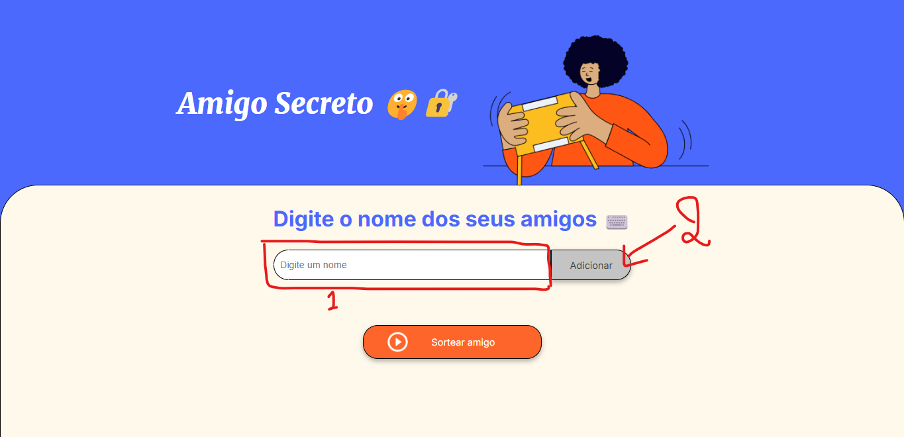
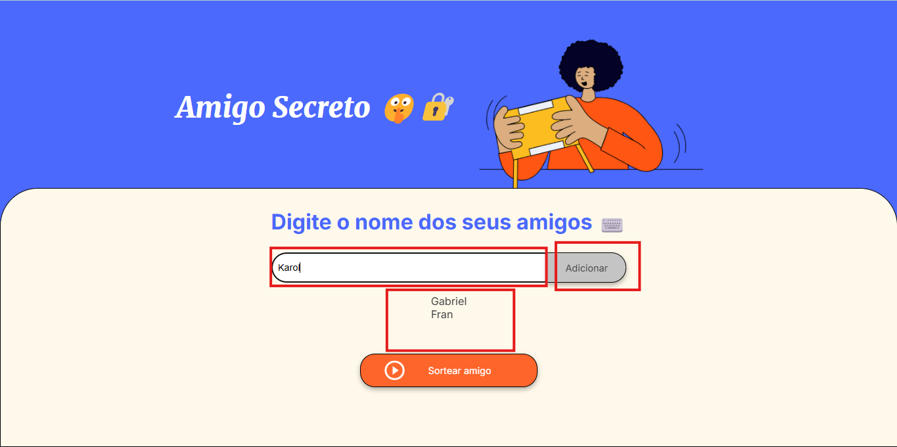
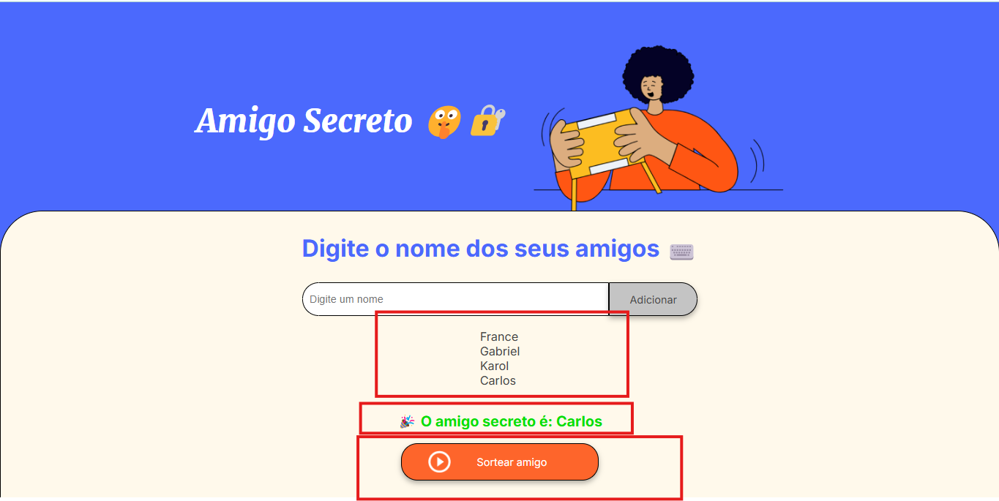

# 🔐 Amigo Secreto 🤫

Um sorteio online simples para organizar trocas de presentes entre amigos! Projeto ideal para iniciantes em programação web.

**Neste passo, você insere o nome dos seus amigos e clica em acicionar.**

**Aqui você consegue ver a lista de amigos depois de adicionar os nomes.**

**Neste passo você faz o sorteio a partir da sua lista de amigos**



## ✨ Funcionalidades

- ✅ Adicionar nomes à lista
- 🚫 Validação de campo vazio
- 📝 Lista visual atualizada automaticamente
- 🎲 Sorteio aleatório com um clique
- 🎉 Exibição animada do resultado

## 🚀 Como Usar

1. **Clone o repositório**
   ```bash
   git clone https://github.com/gabrielCoelho99/challenge_amigo_secreto_ONE.git
2. **Abra o projeto**
- Navegue até a pasta do projeto

- Clique duas vezes no arquivo ``index.html``

3. **Use a aplicação**

- Digite nomes no campo

- Clique em "Adicionar"

- Quando tiver vários nomes, clique em "Sortear"

## 🛠️ Tecnologias Usadas

**HTML** - Estrutura da página

**CSS** - Estilização e design responsivo

**JavaScript** - Lógica de programação

## 🤝 Como Contribuir

**Sua contribuição é bem-vinda! Siga estes passos:**

Faça um Fork do projeto

Crie uma Branch ``(git checkout -b feature/nova-funcionalidade)``

Commit suas mudanças ``(git commit -m 'Adicionei nova feature')``

Push para a Branch ``(git push origin feature nova-funcionalidade``)

Abra um Pull Request

## Feito com ❤️ por Gabriel Moraes - Meu Primeiro Challenge ONE 👶🚀

## 🚀 Próximas atualizações:
* Sons para cada ação no site
* Front-End aprimorado
* Uso de novas tecnologias para validação
* Lógica aprimorada para um melhor funcionamento